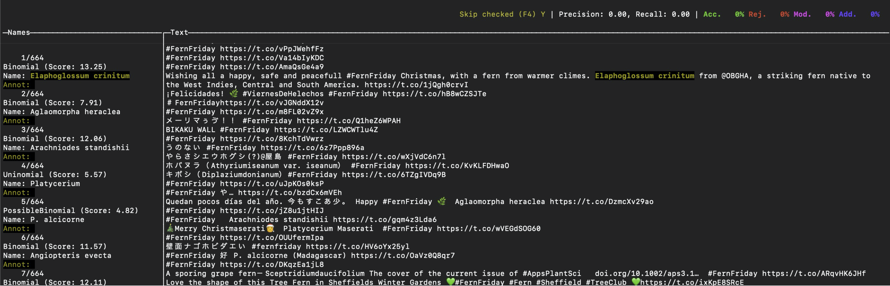

<!----
checklist:
- check the "update me" messages in YAML above
- initialise the _renv folder with refinery::renv_new("name of post folder")
- populate the lockfile with refinery::renv_snapshot("name of post folder")
- update the _renv folder from snapshot with refinery::restore("name of post folder")
---->


<!--------------- setup post ----------------->

```{r setup, include = FALSE}
knitr::opts_chunk$set(echo = TRUE, cache = FALSE)
refinery::renv_load(paste(params$date, params$slug, sep = "_"))
library(tweetrmd)
library(webshot2)
```

```{r xaringanExtra-clipboard, echo = FALSE}
# Enable copy-paste of code chunks
# xaringanExtra::use_clipboard()
htmltools::tagList(
  xaringanExtra::use_clipboard(
    button_text = "<i class=\"fa fa-clipboard fa-2x\"></i>",
    success_text = "<i class=\"fa fa-check fa-2x\" style=\"color: #90BE6D\"></i>",
    error_text = "<i class=\"fa fa-times-circle fa-2x\" style=\"color: #F94144\"></i>"
  ),
  rmarkdown::html_dependency_font_awesome()
)
```

<!--------------- post ----------------->

One of the saving graces of twitter is the existence of things like [#fernfriday](https://twitter.com/hashtag/fernfriday?src=hashtag_click) and other hashtags of people's favorite organisms.

Recently, [\@HannahOish](https://twitter.com/HannahOish) posted [this brief analysis](https://twitter.com/HannahOish/status/1477267832018776068) of the [#FishADay](https://twitter.com/hashtag/FishADay?src=hashtag_click) hashtag:

```{r hannah-tweet, echo = FALSE, cache = TRUE}
tweet_screenshot(tweet_url("HannahOish", "1477267832018776068"))
```

Upon seeing it, I immediately knew what I had to do next: **find out the most popular fern species of [#fernfriday](https://twitter.com/hashtag/fernfriday?src=hashtag_click) in 2021!**

First let's load some packages.

```{r load-packages, cache = FALSE}
library(tidyverse)
library(janitor)
library(fuzzyjoin)
```

# Getting tweets

## rtweet?

The [rtweet](https://github.com/ropensci/rtweet) package is a great way to get twitter data into R.

There is just one problem: it relies on the [official twitter API](https://developer.twitter.com/en/docs/tutorials/getting-started-with-r-and-v2-of-the-twitter-api), which is **limited to tweets in the past week to 10 days or so**, unless you want to shell out \$\$\$ for a paid API account... which I don't.

## snscrape

### Installation

So I will get around this pesky problem by using the [snscrape](https://github.com/JustAnotherArchivist/snscrape) twitter scraper written in python ^[This is probably not within twitter's user guidelines, so use at your own discretion].

snscrape can be installed using [pip](https://pip.pypa.io/en/stable/).

My preferred method for handling python is to use the conda environment manager. We can [use pip within conda](https://www.anaconda.com/blog/using-pip-in-a-conda-environment) to install snscrape by writing an `environment.yml` file like this (thanks to [\@hansheng0512](https://github.com/hansheng0512/tweets-scrapping-using-python)):

```
name: tweets-scraping
dependencies:
- python=3.8
- pip=21.1.3
- pip:
- git+https://github.com/JustAnotherArchivist/snscrape.git
```

Once that is in your working directory, run this to create the environment:

```
conda env create -f environment.yml
```

Now snscrape should be installed and ready to use!

### Scraping

Since `snscrape` is a command-line interface (CLI), the normal way to use it would be to type commands from the command line. But this is an R blog, so let's run it from R using the `system()` command ^[A good way to limit the number of hits when you are testing code is with the `--max-results` option, e.g., `--max-results 10`] ^[Again, inspired by [\@hansheng0512]( https://github.com/hansheng0512/tweets-scrapping-using-python/blob/master/main.py)'s code].

```{r scrape-tweets, cache = TRUE}
# Set some variables, in case we want to modify the search later
DATE_START <- "2021-01-01"
DATE_END <- "2021-12-31"
HASHTAG <- "fernfriday"
JSON_FILENAME = "ff-2021-tweets"

# Compose the command for snscrape to retrieve tweets
command <- glue::glue('snscrape --jsonl --since {DATE_START} twitter-hashtag "{HASHTAG} until:{DATE_END}" > {JSON_FILENAME}.json')

# Run the command inside the conda env
system(
  glue::glue(
    "source ~/miniconda3/etc/profile.d/conda.sh ; 
			 conda activate tweets-scraping ; 
			 {command} ; 
			 conda deactivate")
)
```

Now the tweets have been downloaded in JSON format to `ff-2021-tweets.json`.

## Load tweets into R

We can [load the tweets into R](https://stackoverflow.com/questions/35276184/json-using-jsonlite-parsing-error-in-r) with the `jsonlite` package.

```{r load-tweets-show, echo = TRUE, eval = FALSE}
ff_tweets_raw <- jsonlite::stream_in(file("ff-2021-tweets.json"))
```

```{r load-tweets-run, echo = FALSE, eval = TRUE}
ff_tweets_raw <- jsonlite::stream_in(file(here::here("_posts/2022-01-24_friday-ferns-2021/ff-2021-tweets.json")))
```

Let's take a peek at the data.

```{r peek-data}
glimpse(ff_tweets_raw)
```

There's a lot of stuff in there! Let's clean up the data a bit and just keep the useful bits.

```{r clean-data}
ff_tweets <-
  ff_tweets_raw %>%
    as_tibble() %>%
    select(
      date, url, user, id,
      content = renderedContent,
      lang, coordinates, place,
      contains("count")
    ) %>%
  # Extract data from nested dataframes 
  mutate(
    user = select(user, username, followersCount),
    place = select(place, country),
    coordinates = select(coordinates, longitude, latitude)
    ) %>%
  unnest(c(user, place, coordinates)) %>%
  clean_names()

ff_tweets
```

That's better.

# Extract scientific names with gntagger

So getting our twitter data wasn't that hard, now just to find all the fern species...

Uh-oh. This is easier said than done. Twitter doesn't have a JSON field for fern species!

Luckily this post does have some biological content. For this task I will use [`gntagger`](https://github.com/gnames/gntagger). `gntagger` is a fantastic little CLI written in GO that handles exactly this sort of situation: **it automatically detects species names in raw text** ^[OK it was probably designed more with old biodiversity literature in mind and not twitter, but it works fine either way!].

Installation [is quite simple as described in the `gntagger` docs](https://github.com/gnames/gntagger#installation), so I won't go into that any more here.

`gntagger` requires a plain-text file as input, so let's write out the tweets to a plain text file with one line per tweet:

```{r gntagger-run, echo = FALSE, eval = FALSE}
ff_tweets %>%
  # Replace line breaks with spaces so we get one tweet per line
  mutate(content = str_replace_all(content, "\n", " ")) %>%
  pull(content) %>%
  write_lines(
    here::here("_posts/2022-01-24_friday-ferns-2021/ff-2021-tweet-content.txt"))
```

```{r gntagger-show, echo = TRUE, eval = TRUE}
ff_tweets %>%
  # Replace line breaks with spaces so we get one tweet per line
  mutate(content = str_replace_all(content, "\n", " ")) %>%
  pull(content) %>%
  write_lines("ff-2021-tweet-content.txt")
```

Now, open the text file with `gntagger` ^[You may need to execute this with `./gntagger` if you didn't make `gntagger` executable everywhere by putting it on your `PATH`]:

```
gntagger ff-2021-tweet-content.txt
```

You should see a screen that looks like this:



`gntagger` takes a "android" approach to tagging species names. It first uses its own algorithm to automatically identify all possible species names, then has a very simple user interface (UI) so the user can confirm or reject each candidate name rapidly. According to the [`gntagger` docs](https://github.com/gnames/gntagger#gntagger-), you should be able to get through about "4000 names spread over 600 pages in about 2 hours".

It saves the intermediate output to a folder named after the input file, in this case `ff-2021-tweet-content.txt_gntagger`.

I recommend trying out `gntagger` to see how it works---it definitely looks great for parsing names from old literature!

But you don't have to go through all of the names yourself. In fact, `gntagger`'s initial "guesses" are pretty darn good, and can be used as-is for a rough analysis. Or, you can download the cleaned up version from FIXME: ADD LINK.

Let's read in the `gntagger` results, which are again JSON:

```{r load-gntagger-show, echo = TRUE, eval = FALSE}
ff_species_raw <- jsonlite::fromJSON("ff-2021-tweet-content.txt_gntagger/names.json")

ff_species <- ff_species_raw[["names"]] %>% 
  as_tibble() %>%
  select(type, name, start, end)

ff_species
```

```{r load-gntagger-run, echo = FALSE, eval = TRUE}
ff_species_raw <- jsonlite::fromJSON(here::here("_posts/2022-01-24_friday-ferns-2021/ff-2021-tweet-content.txt_gntagger/names.json"))

ff_species <- ff_species_raw[["names"]] %>% 
  as_tibble() %>%
  select(type, name, start, end)

ff_species
```

The tricky part here is that `gntagger` outputs location by character position, not line.

So we need to figure out which characters match which lines, which in turn match tweets...

```{r calc_start_end}
ff_tweets_start_end <-
  ff_tweets %>%
  mutate(
    # Replace line breaks with spaces so we get one tweet per line
    content = str_replace_all(content, "\n", " "),
    # Count number of characters per tweet
    num_char = nchar(content)) %>%
  select(id, num_char) %>%
  # Calculate start and end of each tweet in characters
  mutate(
    end = cumsum(num_char),
    start = end - num_char + 1,
    start = as.integer(start)) %>%
  select(id, start, end)

ff_tweets_start_end
```

Now we can use the `fuzzyjoin` package to join the species names to the tweets by position.

```{r fuzzy-join}
ff_tweets_species <-
ff_tweets %>%
  left_join(ff_tweets_start_end, by = "id") %>%
  # interval_left_join requires the Bioconductor IRanges package to be installed
  interval_left_join(
    ff_species
  ) %>%
  select(-matches("start|end")) %>%
  # Drop tweets without any species mentioned
  filter(!is.na(name))
```

Let's take a peek at the results.

```{r peek-post-join}
select(ff_tweets_species, content, name)
```

Yay! We've got species names mapped to tweets (and user ID, etc). Notice that some tweets now appear duplicated, since our data are have one row per species mentioned, and some tweets may include multiple species.

<!--------------- appendices ----------------->

```{r, echo = FALSE}
refinery::insert_appendix(
  repo_spec = params$repo, 
  name = paste(params$date, params$slug, sep = "_"),
  source_branch = "main", lockfile_branch = "main"
)
```


<!--------------- miscellanea ----------------->

```{r redirect, echo = FALSE}
refinery::insert_netlify_redirect(
  slug = params$slug, 
  date = params$date
)
```
